# Clawd Companion

A tiny desktop mascot that lives on your Dock and reacts to what [Claude Code](https://claude.com/claude-code) is actually doing — walking over to the app it's working with, jumping for attention when you wander off, and dozing off when nothing's happening.

Clawd is a borderless, always-on-top `NSPanel` rendered with SwiftUI. A Claude Code hook writes a small JSON file every time a tool runs; the app watches that file and turns it into mood, movement, and a state machine that decides whether he's walking, jumping, sleeping, or doing something mood-specific in place.

## How he decides what to do

```
Claude Code tool call  (session_id: abc123)
        │
        ▼
 ~/.claude/hooks/clawd-companion.sh   (PreToolUse / Stop / SessionStart / Notification hooks)
        │  writes
        ▼
 ~/.claude/creature/sessions/abc123.json
   { "state": "typing", "target": "finder", "planning": false }
        │  watched via kqueue (plus a 2s safety rescan)
        ▼
 CompanionState.displayState          walking | jumping | sleeping | active(mood)
        │
        ▼
 CompanionView + DockWalker           renders the sprite, animates position
```

There's one file per session and the file's existence *is* that session's lifetime — see [Multiple sessions](#multiple-sessions).

`displayState` is the single source of truth for what's on screen. Roughly:

- **Any real activity** (a mood other than idle) always wins — typing, thinking, etc. play in place regardless of anything else.
- **Idle + VS Code unfocused, not yet acknowledged** → jump for attention. Refocusing acknowledges it — losing focus again just resumes idle wander/sleep instead of nagging every single time. New activity re-arms the nag.
- **Idle + mid-transit** (walking to a target, walking home, or idly wandering) → keep walking until he actually arrives. Sleep never interrupts a walk in progress.
- **Idle + arrived + been idle 45s+** → sleeping.
- Otherwise → idle wander around the Dock.
- **Plan mode**: whenever Claude Code's permission mode is `"plan"`, a held blueprint is layered on top of whatever's already showing — independent of the rules above, since plan mode can span many tool calls and moods.
- **Needs your input**: a permission prompt (or Claude idle waiting on you) flashes him white and walks him back to the VS Code icon, regardless of focus — this is the one case that overrides an in-progress walk rather than waiting for it to finish.

## Stages & animations

Every GIF below is a real capture of the running app.

### Idle wander

Between tool calls, Clawd ambles between random Dock icons. Standing still between wanders, he glances side to side on a slow cycle rather than just blinking.


### Typing

`Edit`, `Write`, and other file-modification tools drive a quick alternating-leg animation in place.


### Building

`Bash` and other tool calls that don't fit a more specific mood plant him in a stance swinging a hammer on a strike beat — reads as "making something happen" rather than typing.

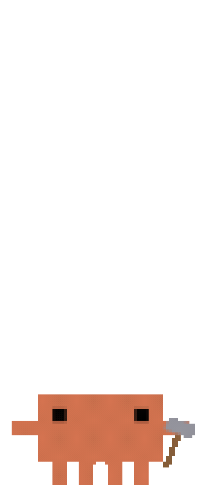

### Thinking

A slow, gentle pulse while Claude is reasoning.

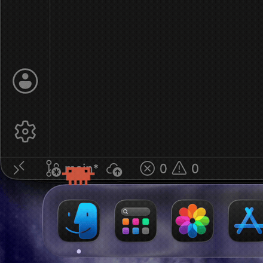

### Inspecting

Eyes dart left and right with a slight lean — shown for tools that "look at" something (`Read`, `Grep`, `Glob`).

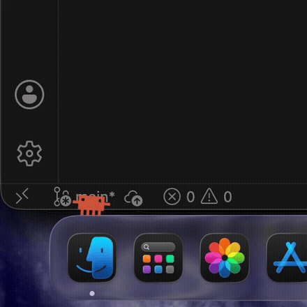

### Planning

Whenever Claude Code is in plan mode, Clawd holds a blueprint — shown for as long as `permission_mode` reports `"plan"`, layered on top of whatever else he's doing in the meantime.


### Celebrating

Triggered by the `Stop` hook when Claude finishes responding — a happy hop with a scale pulse.

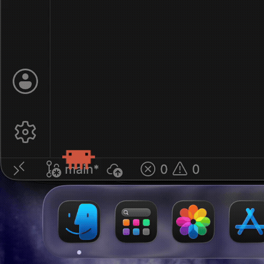

### Waving

Plays once at the start of a session (`SessionStart`) — a side-to-side lean like a wave.


### Jumping (need your attention)

If VS Code loses focus while Claude is otherwise idle, Clawd hops in place near the Dock to nag you back.

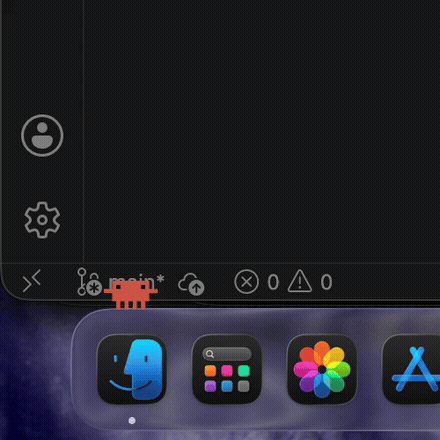

### Needs your input

A permission prompt, or Claude idle waiting on you (the `Notification` hook), flashes him white with a hard scale pulse and walks him straight back to the VS Code icon — regardless of focus, and pre-empting whatever else he was doing. Also fires the completion notification/sound (see [Settings](#settings)) with its own message, so you'll hear about it even if you're not looking at the Dock at all.

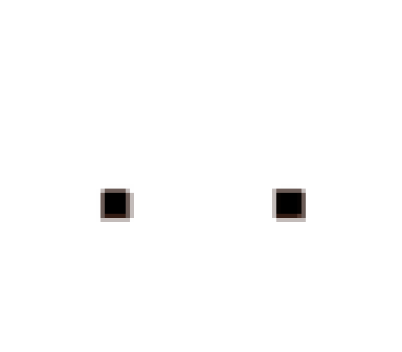

> The flash is a genuine color change, not a fixed image, so on a light GitHub theme the white frames blend into the page background — it reads clearly against the real Dock, and the alternating orange frames still show through in the GIF.

### Sleeping

After ~45 uninterrupted idle seconds *and* having actually arrived wherever he was headed, Clawd's eyes close, he settles into a slow breathing bob, and a few "Z"s float up and fade away.

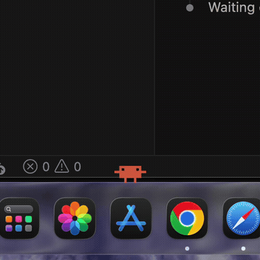

### Walking to a target app

File tools walk him to Finder, browser tools walk him to Chrome/Safari, shell tools walk him to Terminal (if it's running) — all based on which Dock icon the current tool call relates to.

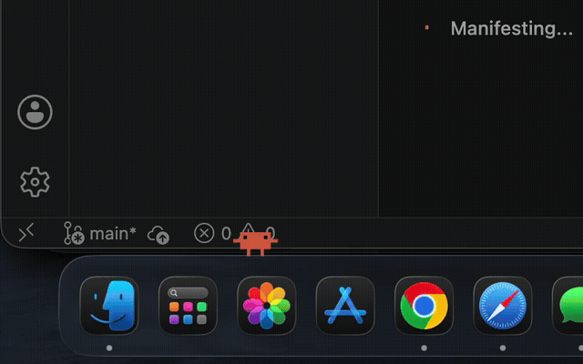

### Coming home

When VS Code regains focus after being away, Clawd stops whatever he's doing and walks back to sit above the VS Code Dock icon — arriving already sleepy, since the time away counts against the idle clock.

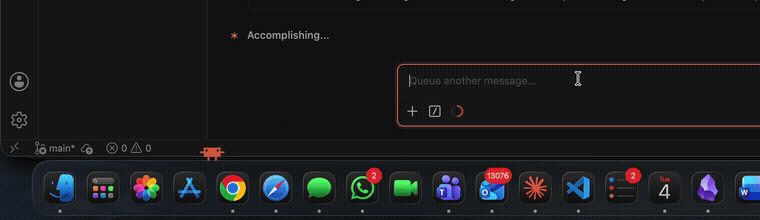

### Hover fade

Hovering the mouse over him fades him to 20% opacity so he never blocks something you're trying to click in the Dock. He isn't draggable — his position is entirely driven by Dock state, not the mouse.

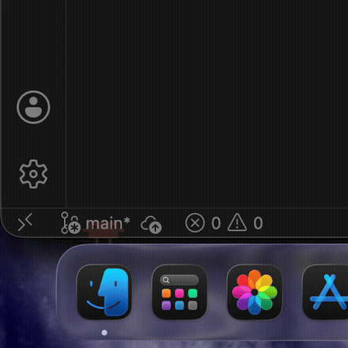

## Multiple sessions

Run more than one Claude Code session at a time and each gets its own Clawd, tinted so you can tell them apart at a glance. The first session keeps the original orange, so a single-session setup looks exactly as it always did.

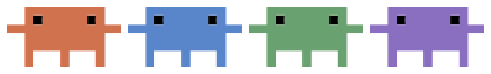

- **Scoped to its own session.** Each companion reads only its own `sessions/<session_id>.json`, so a tool call in one session animates that Clawd and no other. Two sessions can be hammering and planning side by side, independently.
- **Shoulder to shoulder.** Companions are offset horizontally by slot, so when several converge on the same Dock icon they line up instead of stacking.
- **Spawn and despawn.** `SessionStart` writes the file (spawn); `SessionEnd` removes it (despawn). Slots and colors are recycled, so ending the blue session hands blue to the next one that starts rather than marching down the palette. The app quits itself once the last session is gone.

Machine-wide things — VS Code focus, full-screen state, settings, the menu bar item — are shared and broadcast to every companion rather than tracked per session.

## Settings

Clawd puts a small mascot glyph in the menu bar; click it for **Settings…** or **Quit**. You can also **right-click Clawd himself** to get the same menu, and `open -a ClawdCompanion --args --settings` opens Settings directly.

> **Not seeing the glyph?** A menu bar manager (Hidden Bar, Bartender, Ice) files new items into its hidden section, parking them far off-screen — the item exists, it's just not on screen. Expand the manager and ⌘-drag the glyph into the visible area; the position sticks after that. The right-click and `--settings` routes work either way.

| Setting | What it does |
| --- | --- |
| **Size** | Multiplies the Dock-derived sprite size (0.6×–2.0×). Applies immediately. |
| **Walk speed** | Points per second while walking. Trip duration is still clamped at both ends. |
| **Wander when idle** | Turns off the random ambling between Dock icons. |
| **Walk to the app a tool is using** | Turns off Finder/Terminal/browser targeting; moods play in place instead. |
| **Walk home on refocus** | Turns off the walk back to VS Code. He still arrives sleepy — the idle clock is unaffected. |
| **Full-screen peek** | Toggle, plus how long he holds at the top of the peek. |
| **Alerts** | Optionally play a system sound (with a preview button) and/or post a notification, for both a finished response and a prompt needing your input. Both off by default. The notification permission is requested when you switch it on — and again at launch if it's already on — and the row tells you if macOS is blocking them. |

Preferences live in `UserDefaults` under `com.tyvillan.clawdcompanion`.

## Also worth knowing

- **Full-screen apps**: Clawd hides completely while any other app is in real macOS fullscreen, and briefly peeks up from the bottom edge of the screen to signal a completed response before sinking back out of view.
- **Sizing**: he's sized relative to your actual Dock's measured tile size (not a fixed constant), so he scales sensibly across displays and Dock size settings.
- **Signing**: `build.sh` signs with a stable local "Apple Development" identity rather than an ad-hoc signature, so the Accessibility permission grant survives rebuilds.

## Requirements

macOS 14 (Sonoma) or later, Apple Silicon or Intel — `build.sh` produces a universal binary, so either Mac runs it unmodified.

## Setup

Two ways to get the app itself; everything after that (Accessibility, hooks) is the same either way.

### Option A: Download a release

1. Grab the zip from [Releases](https://github.com/tyvillan/clawd-companion/releases), unzip it, and drag `ClawdCompanion.app` wherever you keep apps.
2. **First launch will be blocked by Gatekeeper.** This app is signed with a personal Apple Development certificate, not a paid Developer ID, so it isn't notarized and macOS refuses to open it by default — this is expected, not a broken download. Right-click (or Control-click) the app and choose **Open**, or if that option is unavailable, go to **System Settings → Privacy & Security → Security** and click **Open Anyway** next to the Gatekeeper warning that appears after the first blocked attempt. You only need to do this once.

### Option B: Build from source

```
git clone git@github.com:tyvillan/clawd-companion.git
cd clawd-companion
./build.sh
```

Locally-built apps aren't quarantined, so this has no Gatekeeper prompt at all. Requires Xcode's Command Line Tools (`xcode-select --install`).

### Then, either way

1. Grant Accessibility permission when prompted (needed to read Dock icon positions and walk to them precisely).
2. Copy this repo's `hooks/clawd-companion.sh` to `~/.claude/hooks/clawd-companion.sh` (`mkdir -p ~/.claude/hooks && cp hooks/clawd-companion.sh ~/.claude/hooks/ && chmod +x ~/.claude/hooks/clawd-companion.sh`), then wire it up in `~/.claude/settings.json` to fire on `SessionStart`, `SessionEnd`, `UserPromptSubmit`, `PreToolUse`, `Stop`, and `Notification`. It's a plain copy, not a symlink, deliberately — a hook that runs on every tool call shouldn't depend on this iCloud-synced repo being reachable at that instant (see the iCloud caveat in the parent `Projects/CLAUDE.md`). If you edit the hook, copy it over again afterward.
3. Launch the app — `open ClawdCompanion.app` (or `open build/ClawdCompanion.app` if you built it).
